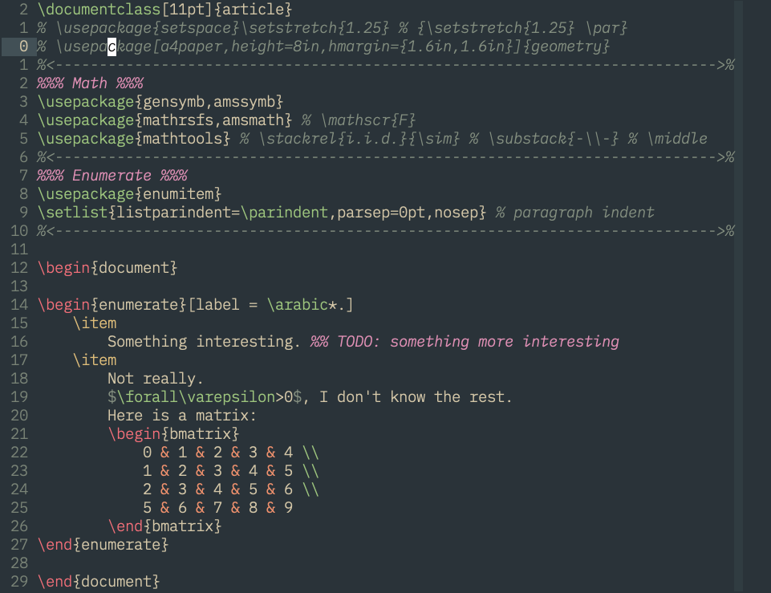
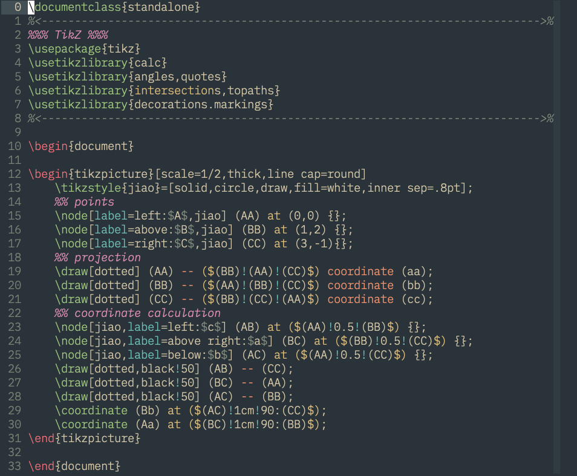

# vim-SimpleColorsLatex : A Simpler LaTeX Syntax Highlighting for Vim

Since most LaTeX syntax highlight in Vim are way too complicated (causing Vim
to be extremely slow on large TeX files) and unnecessarily colourful, I created
my own LaTeX syntax highlight file with the aim of being *simple* and *readable*.

Also, there are specific highlighting groups for *TikZ* and *Beamer*.
Both can be toggled on/off using some custom functions.

Here is a sample screen shot:



Here is a sample screen shot with syntax highlighting for *TikZ*:



# General Syntax Highlighting

As shown in the sample above.
Here are some quick descriptions:

- environment commands (`begin`, `end`) are in red.
- `\item` is in yellow.
- all other commands (anything starting with a backslash followed by a string
  of alphabets)are in green.
- commands (or some escape characters) not followed by alphabets (e.g. `\,`,
  `\%`) are in yellow.
- `%%` type comments are in purple (matched to `Todo` group).
- `$` are in grey and no spellcheck between two `$`'s (inline math mode).
- `&` are in orange.
- references are in orange (including `\label`, `\ref`, `\pageref`).
- size modifying commands (e.g. `\right`, `\left`, `\big`) are in grey.

# *TikZ* Syntax Highlighting

I match some common *TikZ* syntax (such as `--`, `|-`, `($$)`) to make *Tikz*
commands more readable. (see demo above)

*TikZ* syntax highlighting can be toggled using a custom function below:

```vim
""" toggles tikz syntax highlighting
if exists('*TikzSyntax')
	finish
endif
function! TikzSyntax()
	silent split ~/.vim/syntax/tex.vim
	silent g/tikz/norm gcc
	silent norm _
	if ( getline(".")[col(".")-1] == '"' )
		echom "Tikz syntax: OFF"
	else
		echom "Tikz syntax: ON"
	endif
	silent wq
	silent setl ft=tex
endfunction
```

I have this function in `.vim/ftplugin/tex.vim`.
The function toggle between commenting and uncommenting 
TikZ related syntax commands in the syntax files when called.
This function depends on the plugin [tpope/vim-commentary](https://github.com/tpope/vim-commentary),
specifically the command `gcc` to toggle comments,
but it can be modified to function without the plugin.

# *Beamer* Syntax Highlighting

I only matched one group for *beamer* syntax: the keyword `frame`.

Similar to *TikZ* highlighting, one can modify the above function to toggle
beamer specific syntax highlighting.
Here is the function I have in my $ftplugin/tex.vim$:

```vim
""" toggles Beamer syntax highlighting
if exists('*BeamerSyntax')
	finish
endif
function! BeamerSyntax()
	silent split ~/.vim/syntax/tex.vim
	silent g/beamer/norm gcc
	silent norm _
	if ( getline(".")[col(".")-1] == '"' )
		echom "Beamer syntax: OFF"
	else
		echom "Beamer syntax: ON"
	endif
	silent wq
	silent setl ft=tex
endfunction
```

# Todo

- [ ] Make math environments (e.g. `align`, `equation`, `gather`, etc.)
  "NoSpell". That is, when spell check is turned on, the commands in
  those environments should not be spell-checked.
	- Currently inline math is not spell-checked.
	- For example, the `tX` in `$\Pr(e^{tX})$` is not marked as incorrect when
	  spell check is on; but the `tX` in
	  ```latex
	  \begin{align}
	      \Pr(e^{tX})
	  \end{align}
	  ```
	  is marked as incorrect.
